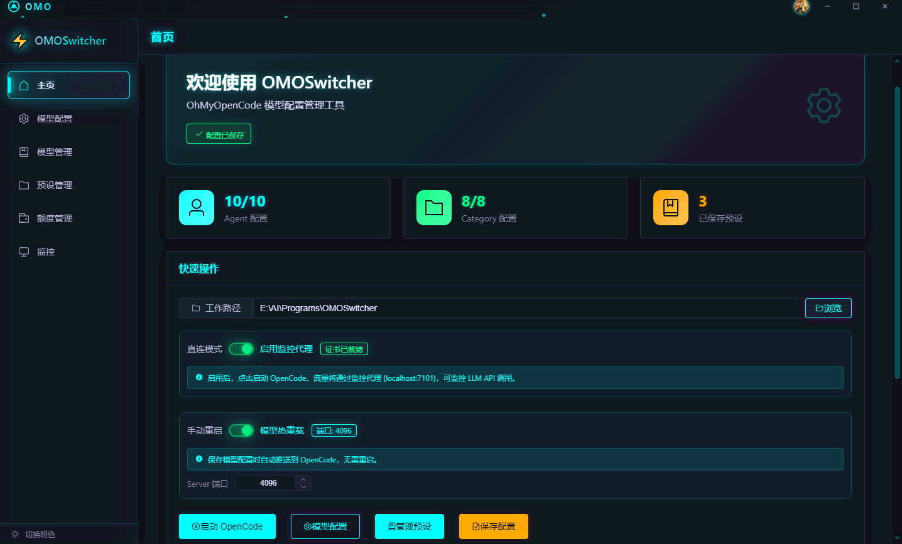

<div align="center">

# OMOSwitcher

**OhMyOpenCode 模型配置管理工具**

[](https://tauri.app/)
[](https://vuejs.org/)
[](https://www.typescriptlang.org/)
[](https://www.rust-lang.org/)
[](LICENSE)



</div>

---

## 功能

- **Agent / Category 配置** — 为 Sisyphus、Oracle、Librarian 等 Agent 和 Visual Engineering、Deep 等 Category 分别指定模型
- **模型列表管理** — 自定义可用模型，自动读取 `opencode.json` Provider 配置
- **预设管理** — 保存、切换、GitHub 云同步多套模型配置方案
- **额度查询** — 多供应商配额监控，用量、百分比、重置倒计时一目了然
- **API 监控** — 实时统计请求数、Token 消耗与费用，按时间维度汇总

## 快速开始

```bash
git clone https://github.com/BoCai666/OMOSwitcher.git
cd OMOSwitcher
npm install
npm run tauri:dev      # 开发
npm run tauri:build    # 构建
```

环境要求：Node.js 18+、Rust 1.70+

## 数据目录

| 数据 | 路径 |
|:-----|:-----|
| 主配置 | `~/.config/opencode/oh-my-opencode.json` |
| 模型列表 | `~/.config/omoswitcher/models.json` |
| 预设 | `~/.config/omoswitcher/presets/` |
| 监控数据 | `~/.config/omoswitcher/monitor/data.db` |

## 相关项目

- [OhMyOpenCode](https://github.com/code-yeongyu/oh-my-opencode) — AI 编程助手核心
- [OpenCode](https://github.com/opencode-ai/opencode) — OpenCode CLI

---

<div align="center">

[MIT](LICENSE) © 2025

</div>
